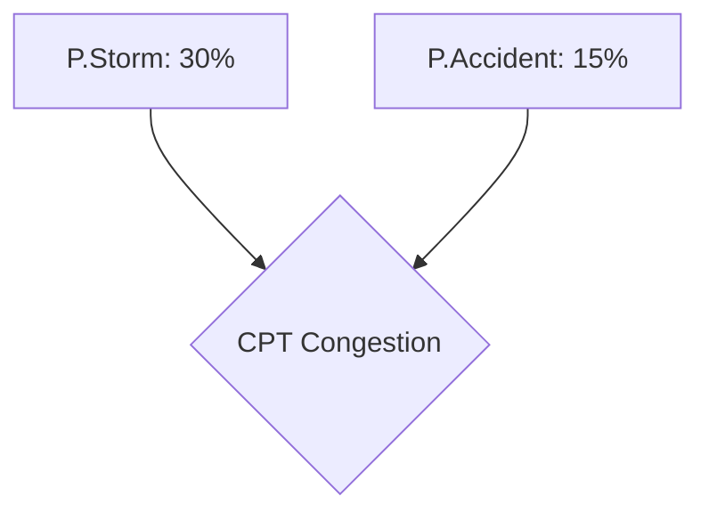
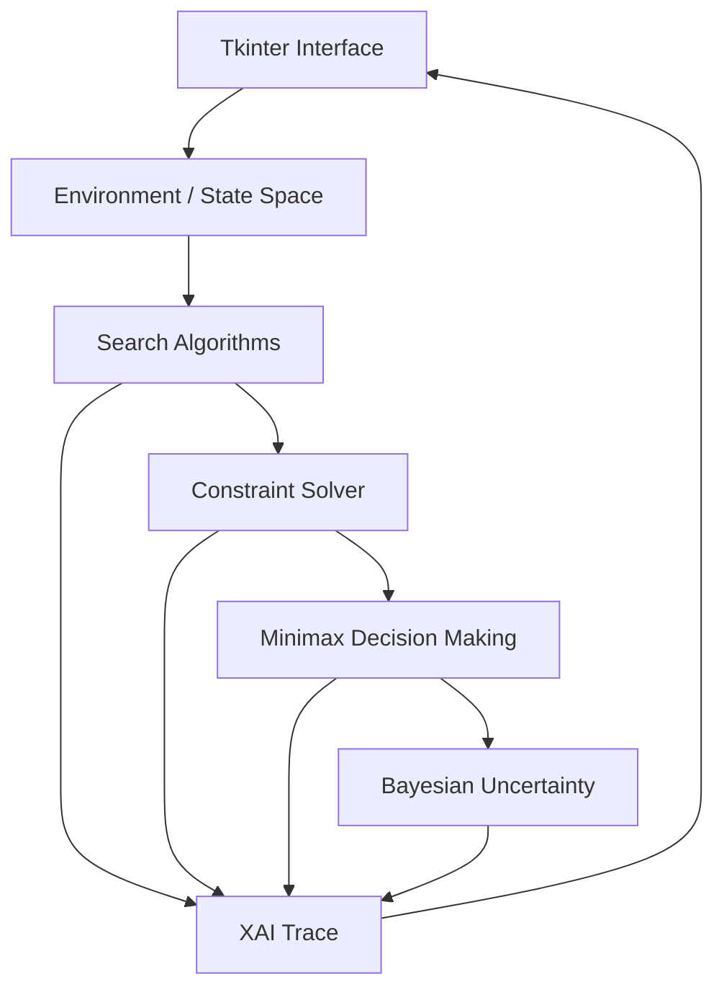

# AI Tourist Route Planner

An interactive, AI-powered tourist route planning system that combines classical search algorithms, constraint satisfaction, adversarial decision-making, Bayesian uncertainty modeling, and explainable AI to generate and visualize routes under real-world constraints.

---

## Overview
The **AI Tourist Route Planner** simulates an urban tourist navigation system. Users can interactively define start and goal coordinates, paint obstacles (unpassable terrain), and mark high-traffic zones on a $20 \times 20$ grid. 

The core routing engine computes optimal paths under dynamic traffic delays and resource limits, while a Bayesian network models uncertainty (such as weather anomalies or road accidents) to dynamically scale path weights. Explanations are compiled into natural language reasoning traces to make the routing decision transparent.

---

## Why This Project?
This project serves as an educational and portfolio-ready demonstration of integrating multiple AI paradigms—classical search, constraint satisfaction, adversarial reasoning, and probabilistic networks—into a single, cohesive desktop application. It illustrates how different AI systems can work together in a structured pipeline to solve real-world routing and decision-making problems.

---

## Features
- **Interactive Grid Environment**: Left-click to draw start points, goals, impassable obstacles, and high-traffic zones. Right-click to toggle traffic zones quickly.
- **Visualized Search Realization**: Real-time step-by-step animations showing the search frontier (nodes explored), the reconstructed optimal path, and the traversing agent.
- **Dynamic Resource Constraints**: Real-time budget and travel-time bounds adjusted via slider controls with visual forward-checking validation.
- **Stochastic Weather and Accident Simulation**: Bayesian Network calculating conditional probability tables for congestion and adjusting edge costs dynamically.
- **Explainable Decision Making**: Natural language reports explaining why an algorithm was chosen, the impact of traffic crossings, and how budget limits were evaluated.

---

## AI Concepts

### State-Space Search
The routing grid is modeled as a state-space graph where transitions occur between cardinal grid coordinates. The planner uses search algorithms to find paths from the start coordinate to the goal coordinate.

### BFS (Breadth-First Search)
Explores level-by-level using a FIFO queue structure. Guaranteed to find the shortest path in terms of transition/edge count. Optimal for unweighted graphs.

### DFS (Depth-First Search)
Explores deep paths using a stack structure. It does not guarantee path optimality or shortest steps but is useful for deep graph exploration.

### Uniform-Cost Search (UCS)
Explores nodes in order of minimum cumulative cost $g(n)$ using a Priority Queue. Guarantees the cheapest path on weighted graphs with non-negative edge costs. Incorporates stale-entry check optimizations to prune redundant node expansions.

### A\* Search
Combines cumulative cost $g(n)$ and a heuristic estimate $h(n)$ to the goal:
$$f(n) = g(n) + h(n)$$
Using the **Manhattan Distance** heuristic on our cardinal grid:
$$h(n) = |x_n - x_{goal}| + |y_n - y_{goal}|$$
*Mathematical Property*: Because steps cost $\ge 1$ and movement is strictly cardinal, the Manhattan distance is **admissible** (never overestimates distance to goal) and **consistent** ($|h(u) - h(v)| \le \text{cost}(u,v)$), guaranteeing that A\* finds the optimal path without needing node reopening. Incorporates stale-entry check optimizations to prune redundant node expansions.

### Constraint Satisfaction
The Constraint Satisfaction Problem (CSP) engine ensures route viability:
- **Physical Boundary & Obstacle constraints**: The route must not pass through boundary edges or impassable obstacles.
- **Resource budget constraints**: The accumulated path cost must be $\le$ the financial budget limit, and computation time must be $\le$ the travel time limit.

### Minimax
A Minimax lookahead game-tree (depth 3) evaluates the stability of paths against dynamic traffic changes:
- **Maximizer (Traffic/Environment)**: Simulates worst-case scenario traffic increases on neighboring cells.
- **Minimizer (Agent/Planner)**: Chooses actions that minimize the distance to the goal plus transit costs.

### Bayesian Uncertainty
Congestion is modeled stochastically using a Bayesian Network representing joint dependencies between weather conditions (Storm), road incidents (Accident), and congestion:



The Conditional Probability Table (CPT) for Congestion evaluates to:
- $P(\text{Congestion} \mid \text{Storm}, \text{Accident}) = 0.95$
- $P(\text{Congestion} \mid \text{Storm}, \neg \text{Accident}) = 0.70$
- $P(\text{Congestion} \mid \neg \text{Storm}, \text{Accident}) = 0.85$
- $P(\text{Congestion} \mid \neg \text{Storm}, \neg \text{Accident}) = 0.20$

If congestion occurs, the transition step cost scales stochastically:
$$\text{Cost} = \text{Base Cost} (1.0) + P(\text{Congestion}) \times \text{Delay Multiplier}$$
where the delay multiplier is drawn from a uniform distribution $[2.5, 6.5]$.

### Explainable AI
The Explainable AI (XAI) engine acts as a translator between numerical search metrics and human comprehension. It processes:
- Explored nodes and steps taken.
- Active traffic cells crossed.
- Percentage of budget saved/exceeded.
It then compiles these variables into a readable paragraph detailing the planning decisions.

---

## Architecture
The application is structured into decoupled, modular components:



---

## Algorithm Comparison

| Algorithm | Search Type | Heuristic | Optimality | Typical Use |
| :--- | :--- | :---: | :---: | :--- |
| **BFS** | Uninformed | No | Unit-cost graphs | Shortest path (steps) |
| **DFS** | Uninformed | No | No | Graph exploration |
| **UCS** | Cost-based | No | Yes* | Minimum-cost weighted path |
| **A\*** | Informed | Yes | Yes* | Efficient optimal pathfinding |

*\*Notes on Optimality assumptions:*
- BFS is optimal in steps but not in path cost if weights differ.
- UCS and A\* guarantee path cost optimality on finite graphs with non-negative edge costs.
- A\* optimality is guaranteed because the Manhattan Distance heuristic is admissible and consistent on our cardinal grid.

---

## Project Structure
```text
TouristRoutePlanner/
├── main.py            # Main entry point (Tkinter loop initialization)
├── gui.py             # UI layout, pill buttons, grid canvas, and animation logic
├── environment.py     # Grid boundaries, neighbors definition, and landmark identities
├── search.py          # Optimized search algorithms (BFS, DFS, UCS, A*)
├── constraints.py     # CSP budget limits and obstacle checks
├── decision.py        # Minimax game tree lookahead and XAI trace generator
├── uncertainty.py     # Bayesian Network, congestion CPTs, and dynamic cost scaling
├── tests/             # Automated test suite
│   ├── __init__.py
│   ├── test_search.py
│   ├── test_csp.py
│   ├── test_uncertainty.py
│   └── test_minimax.py
├── requirements.txt   # Standard library dependency documentation
└── .gitignore         # Git ignore file configuration
```

---

## Screenshots
*(Optional showcase images can be placed here)*
- **Main Interface**: Dashboard showcasing grid overlay, module cards, and XAI panel.
- **Path Search**: Animated route trace showing BFS vs A\* node expansions.

---

## Installation

### Prerequisites
- macOS, Linux, or Windows
- Python 3.13+
- Tkinter library support (typically bundled with Python; on Linux/brew, install via `brew install python-tk` or `sudo apt-get install python3-tk`)

### Virtual Environment Setup
1. Clone the repository and navigate into the folder:
   ```bash
   cd TouristRoutePlanner
   ```
2. Create and activate a fresh virtual environment:
   ```bash
   python3 -m venv .venv
   source .venv/bin/activate
   ```
3. Verify requirements (no external packages are required):
   ```bash
   pip install -r requirements.txt
   ```

---

## Usage
To launch the Tkinter GUI:
```bash
python main.py
```

---

## Running Tests
To run the automated test suite in verbose mode:
```bash
python -m unittest discover -s tests -v
```

---

## Test Coverage / Verification
The test suite consists of **37 independent unit tests** validating:
- **Search Logic**: Pruning check validations, correct path cost, obstacle boundary check, and duplicate queue expansion safety.
- **CSP Engine**: Out-of-bounds, exact boundary, obstacle checks, and budget compliance bounds.
- **Bayesian Uncertainty**: Priors initialization, probability boundaries ($0 \le P \le 1$), cost scaling, and seeded test repeatability.
- **Minimax Lookahead**: Maximizer, minimizer, and terminal lookahead depth validations.

---

## Design Decisions
- **Tkinter Standard Library**: Used to ensure cross-platform compatibility and zero setup friction (no external GUI package overhead).
- **Stale-Entry Checking**: By checking `active_cost > cumulative_costs[active_node]` immediately upon popping from the PriorityQueue, we prune redundant frontier expansions. This reduces state expansion overhead, leading to faster execution times and a cleaner UI search visualization trace.

---

## Performance Considerations
- **Headless Tests**: All core logic tests are decoupled from Tkinter GUI states, allowing them to run headlessly in CI/CD pipelines (e.g. GitHub Actions).
- **Consistent Heuristic**: Since the Manhattan Distance is consistent on cardinal grids, we do not need to implement complex node-reopening logic in A\* search, preserving optimal $O(|V| \log |V|)$ efficiency.

---

## Limitations
- Diagonal travel is not currently supported (4-way cardinal grid only).
- Dynamic traffic cells are stochastic but static within a single search run (no moving obstacles).

---

## Future Improvements
- Support for diagonal travel (8-way movement with Diagonal/Octile distance heuristic).
- Dynamic replanning (D\* Lite) for moving obstacles.

---

## License
*A licensing choice (e.g., MIT, Apache 2.0, or Proprietary) has not yet been finalized. Please consult repository maintainers before public distribution.*
